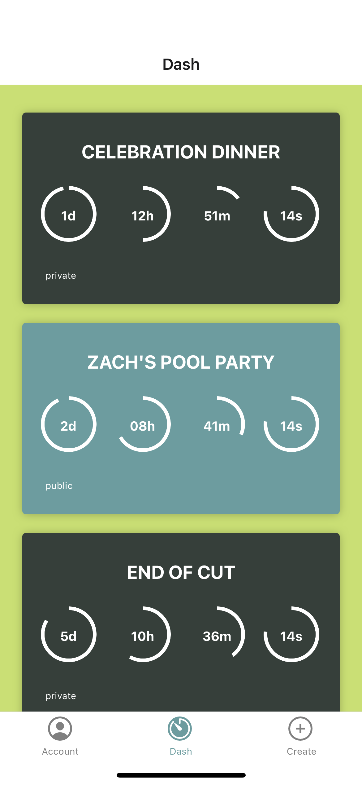

<h1 align="center">OUR-GLASS | A Social Media Event Countdown App</h1>

  
## Table of Contents
- [Description](#description)  
- [Deployment](#deployment)  
- [Contributions](#contributions)  
- [License](#license)  
- [Technologies](#technologies)  
- [Installation](#installation) 
- [Screenshot](#screenshot)
- [Questions](#questions)  
  
## Description
Our Project is a compilation of all the technologies covered throughout The Coding Boot Camp UT Austin course. Our MERN stack single-page application allows the user to countdown to a special event or date in their lives. The user can allow the event post to be public or private and can engage friends and family to jion the countdown. The app allows the user to blast the countdown event to popular social media platforms like facebook and instgram.
  
## Deployment  
Download the application folder. Use Terminal to navigate to the project directory and type the following: `npm start`.  
  
## Contributions
Antony Quinones 
Brandon Henry 
H. Mark Estrada 
Nicolas Young 
Vivianna Mueller 
  
## License
 
This application is covered by the MIT license. 
  
## Technologies  

 

  
## Installation  
Run the following command at the root of your project: npm install 
  
## Screenshot

  
## Questions  
GitHub: [maddnty](https://github.com/maddnty/our-glass) 
To learn React, check out the [React documentation](https://reactjs.org/). 
Contact me with any questions: h.mark.estrada@gmail.com 
Copyright 2022 © AllRights Reserved. 
